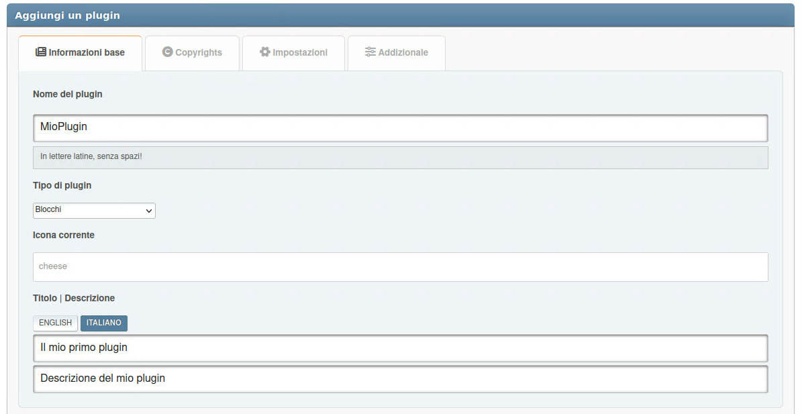

# Aggiungi Plugin

I plugin sono le estensioni che espandono le capacità del Light Portal. Per creare il tuo plugin, basta seguire le istruzioni seguenti.

:::info

Puoi utilizzare **PluginMaker** come assistente per creare i tuoi plugin. Scaricalo e abilitalo nella pagina _Amministrazione -> Portale -> Plugins_.



:::

## Scelta del tipo di plugin

Scelta del tipo di plugin

### `block`

Plugin che aggiungono nuovi tipi di blocchi per il portale.

### `ssi`

Plugin (solitamente blocchi) che utilizzano le funzioni SSI per recuperare dati.

### `editor`

Plugin che aggiungono un editor di terze parti per diversi tipi di contenuti.

### `comment`

Plugin che aggiungono un widget di terze parti invece del widget integrato.

### `parser`

Plugin che implementano l'analisi del contenuto di pagine e blocchi.

### `article`

Plugin per l'elaborazione del contenuto delle schede degli articoli nella pagina principale.

### `frontpage`

Plugin per modificare la pagina principale del portale.

### `impex`

Plugin per importare ed esportare vari elementi del portale.

### `block_options` | `page_options`

Plugin che aggiungono parametri aggiuntivi per l'entità corrispondente (blocco o pagina).

### `icons`

Plugin che aggiungono nuove librerie di icone per sostituire gli elementi dell'interfaccia o da utilizzare nelle intestazioni dei blocchi

### `seo`

Plugin che in qualche modo influenzano la visibilità del forum in rete.

### `other`

Plugin che non sono correlati a nessuna delle categorie sopra indicate.

## Creazione della cartella del plugin

Crea una cartella separata per i file del plugin, all'interno di `/Sources/LightPortal/Addons`. Ad esempio, se il tuo plugin si chiama "HelloWorld", la struttura delle cartelle dovrebbe assomigliare a questa:

```
...(Addons)
└── HelloWorld/
    ├── langs/
    │   ├── english.php
    │   └── index.php
    ├── index.php
    └── HelloWorld.php
```

Il file `index.php` può essere copiato da cartelle di altri plugin. Il file `HelloWorld.php` contiene la logica del plugin:

```php:line-numbers
<?php

/**
 * HelloWorld.php
 *
 * @package HelloWorld (Light Portal)
 * @link https://custom.simplemachines.org/index.php?mod=4244
 * @author Nickname <email>
 * @copyright 2023 Nickname
 * @license https://spdx.org/licenses/GPL-3.0-or-later.html GPL-3.0-or-later
 *
 * @category addon
 * @version 23.03.23 (date when the source code of the plugin was created or last updated, in the format dd.mm.yy)
 */

namespace Bugo\LightPortal\Addons\HelloWorld;

use Bugo\LightPortal\Addons\Plugin;

if (! defined('LP_NAME'))
	die('No direct access...');

class HelloWorld extends Plugin
{
    // Used properties and methods
    // Access to global variables: $this->context['user'], $this->modSettings['variable'], etc.
    // Access to language variables: $this->txt['lp_hello_world']['variable_name']
}

```

## Uso di SSI

Se il plugin deve recuperare dati utilizzando le funzioni SSI, utilizzare il metodo integrato `getFromSsi(string $function, ...$params)`. Come parametro `$function` bisogna passare il nome di una delle funzioni contenute nel file **SSI.php**, senza prefisso `ssi_`. Ad esempio:

```php
<?php

// See ssi_topTopics function in the SSI.php file
$data = $this->getFromSsi('topTopics', 'views', 10, 'array');
```

## uso di Composer

Il tuo plugin può utilizzare librerie di terze parti installate tramite Composer. Assicurati che il file `composer.json`, che contiene le dipendenze necessarie, si trovi nella cartella del plugin. Prima di pubblicare il tuo plugin, apri la cartella dei plugin con il terminale ed esegui il comando: `composer install --no-dev -o`. Successivamente, l'intero contenuto della cartella dei plugin può essere impacchettato come una modifica separata per SMF (vedi ad esempio il pacchetto **PluginMaker**).
